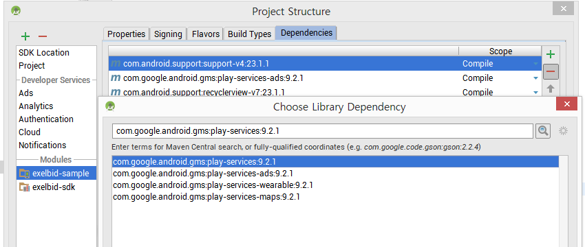

목차
=================

* [시작하기](#시작하기)
* [어플리케이션 설정](#어플리케이션-설정)
  * [ExelBid SDK 추가하기](#exelbid-sdk-추가하기)
  * [Google Library 추가하기](#google-library-추가하기)
  * [프로가드 설정](#프로가드-설정)
  * [AndroidManafest 설정](#androidmanafest-설정)
  * [Permission 설정](#permission-설정)
* [광고 적용하기](#광고-적용하기)
  * [인스턴스 공통 메소드](#인스턴스-공통-메소드)
  * [배너광고](#배너광고)
  * [전면 광고](#전면-광고)
  * [네이티브](#네이티브)
  * [네이티브 Adapter](#네이티브-adapter)
  * [다이얼로그 공통 메소드](#다이얼로그-공통-메소드)
  * [다이얼로그 광고 (전면)](#다이얼로그-광고-전면)
  * [다이얼로그 광고 (네이티브)](#다이얼로그-광고-네이티브)


## 시작하기

1. 계정을 생성합니다
2. Inventory -> New App을 선택합니다.<br/>


3. 앱정보를 등록한 후, unit을 생성 합니다.

## 어플리케이션 설정

### ExelBid SDK 추가하기
* Android Studio
	1. 모듈의 build.gradle파일에 dependencies에 아래 항목을 추가합니다.
	```java
    dependencies {
        	compile 'com.onnuridmc.exelbid:exelbid:1.0.1'
	}
    ```

* 이클립스
    1. 홈페이지에서 SDK를 다운로드 받습니다.
    2. espresso-sdk.jar를 복사하여 프로젝트의 /libs폴더에 저장합니다.

<br/>
### Google Library 추가하기
> ExelBid Android SDK가 제대로 작동하려면 Google Play Service 4.0 이상의 라이브러리가 필요합니다. 광고 식별자 수집에 대한 Google Play 콘텐츠 가이드라인을 준수하기 위한 것입니다.

1. ``AndroidManifest.xml``파일에 <application> 태그 안에 아래 코드를 추가합니다.
```xml
<meta-data
android:name="com.google.android.gms.version"
android:value="@integer/google_play_services_version" />
```

2. Google Play Service jar를 dependencies에 추가합니다.
poject structure -> dependencies -> add -> library dependency 에서 com.google.android.gms:play-services or com.google.android.gms:play-services-ads를 추가합니다

_* eclipse를 사용하는 경우에는 Google Play Service 라이브러리 프로젝트를 추가합니다._


<br/>

### 프로가드 설정

```java
-keep class com.google.android.gms.ads.identifier.AdvertisingIdClient{public *;}
-keep class com.google.android.gms.ads.identifier.AdvertisingIdClient$Info{public *;}
-keep class com.google.android.gms.common.api.GoogleApiClient { public *; }
-keep class com.google.android.gms.common.api.GoogleApiClient$* {public *;}
-keep class com.google.android.gms.location.LocationServices {public *;}
-keep class com.google.android.gms.location.FusedLocationProviderApi {public *;}

-keepattributes SourceFile,LineNumberTable,InnerClasses
-keep class com.onnuridmc.exelbid.** { *; }
```

<br>
### AndroidManafest 설정

>MetaData와 com.onnuridmc.exelbid.common.ExelBidActivity를 AndroidManafest.xml의 <applicatrion> 태그 안에 추가합니다. 이 Activity는 전면광고를 표시하는데 사용됩니다.
```xml
<activity android:name="com.onnuridmc.exelbid.common.ExelBidActivity"
          android:configChanges="keyboardHidden|orientation|screenSize">
</activity>
<meta-data android:name="com.exelbid.appkey"
           android:value="{홈페이지에 등록한 어플리케이션의 아이디}"/>
```

<br>
### Permission 설정

* 필수권한
```xml
<uses-permission android:name="android.permission.INTERNET" />
<uses-permission android:name="android.permission.ACCESS_NETWORK_STATE" />
```

* 권장권한
```xml
<uses-permission android:name="android.permission.ACCESS_COARSE_LOCATION" />
<uses-permission android:name="android.permission.ACCESS_FINE_LOCATION" />
<uses-permission android:name="android.permission.ACCESS_WIFI_STATE" />
<uses-permission android:name="android.permission.CHANGE_WIFI_STATE" />
```

<br>
## 광고 적용하기

### 인스턴스 공통 메소드

>광고의 효율을 높이기 위해 나이, 성별을 설정하는 것이 좋습니다.

*	setYob(String) : 태어난 연도 4자리(2016)
*	setGender(boolean) : 성별 (true : 남자, false : 여자)
*	addKeyword(String, String) : Custom 메타 데이터 (Key, Value)
*	setTestMode(Boolean) : 광고의 테스트를 위해 설정하는 값입니다. 통계에 적용 되지 않으며 항상 광고가 노출되게 됩니다.
*	setAdUnitId(String) : 광고 아이디를 셋팅 합니다.


### 배너광고

>띠 배너 형태의 광고를 사용합니다.

1.  배너 광고 인스턴스를 원하는 layout위치에다가 생성합니다.
  ```xml
  <com.onnuridmc.exelbid.ExelBidAdView
       android:id="@+id/adview"
       android:layout_width="match_parent"
       android:layout_height="wrap_content">
  </com.onnuridmc.exelbid.ExelBidAdView>
  ```

2. Activity에서 해당 인스턴스를 바인딩 합니다.
  ```java
  ExelBidAdView mAdView = (ExelBidAdView) findViewById(R.id.adview);
  ```

3. 사이트로부터 발급받은 유닛 아이디를 확인합니다
  

4. 유닛아이디를 배너 인스턴스에 셋팅합니다.
  ```java
  setAdUnitId(String)
  ```

5. 광고를 요청합니다.
  ```java
  loadAd()
  ```

6. 광고 이벤트 등록
  * ``setAdListener(OnBannerAdListener)``
    - ``onAdLoaded()`` : 광고가 로딩된 시점에 호출 됩니다.
    - ``onAdFailed(ExelBidError)`` : 서버로부터 광고를 가져오지 못한 경우에 호출 됩니다.
    - ``onAdClicked()`` : 광고 클릭시 호출 됩니다.

7. 기본적으로 띠배너의 광고의 경우 유닛에 설정한 리플래쉬 시간에 따라 자동으로 갱신 됩니다. 해당 기능을 사용하지 않게 하기 위해서는 리플래쉬 기능을 해제해 주어야 합니다.
  ```java
  setAutoreflashDisable()
  ```

8. Activity 종료시 destroy를 호출해야 합니다.
  ```java
  destroy()
  ```

### 전면 광고
1.	전면 광고 인스턴스를 생성합니다.
	```java
    ExelBidInterstitial mInterstitialAd = new ExelBidInterstitial(this, "홈페이지에서 발급받은 전면광고 유닛 아이디");
    ```

2.	전면 광고 요청
	```java
	loadAd()
	```
3.	광고 로딩 확인
	```java
	(Boolean) isReady() //전면 광고를 노출시킬 준비가 되어있는지 체크한다.
	```

4.	전면 광고 노출
	```java
	show() // 전면 광고를 노출합니다.
    ```

5.	광고 이벤트 등록
	*	``setInterstitialAdListener(OnInterstitialAdListener)``
		-	``onInterstitialLoaded`` : 광고가 로딩된 시점에 호출 됩니다.
		-	``onInterstitialShow`` : 전면 광고가 사용자에게 노출된 시점에 호출됩니다.
		-	``onInterstitialDismiss`` : 사용자가 전면광고를 닫았을 때 호출 됩니다.
		-	``onInterstitialClicked`` : 광고 클릭시 호출 됩니다.
		-	``onInterstitialFailed`` : 서버로부터 광고를 가져오지 못한 경우에 호출 됩니다.

6.	Activity 종료시 destroy를 호출합니다.
	```java
	destroy()
	```


### 네이티브
1.	네이티브 광고 인스턴스를 생성합니다.
    ```java
    ExelBidNative mNativeAd = new ExelBidNative(this, mUnitId, new OnAdNativeListener() {
        @Override
        public void onFailed(ExelBidError error) {
        }
        @Override
        public void onShow() {
        }
        @Override
        public void onClick() {
        }
        @Override
        public void onLoaded() {
        }
    });
    ```
    -	``onFailed`` : 광고 요청 실패시 호출 됩니다.
    -	``onShow`` : 광고가 사용자에게 노출 되었을 경우에 호출 됩니다.
    -	``onClick`` : 사용자가 광고를 클릭할 경우에 호출됩니다.
    -	``onLoaded`` :  서버로부터 광고를 가져 왔을 경우에 호출 됩니다.

2.	광고가 노출될 영역에 대한 정보를 바인딩 합니다.
    ```java
    mNativeAd.setNativeViewBinder(new NativeViewBinder.Builder(mNativeRootLayout)
              .mainImageId(R.id.native_main_image)
              .callToActionButtonId(R.id.native_cta)
              .titleTextViewId(R.id.native_title)
              .textTextViewId(R.id.native_text)
              .iconImageId(R.id.native_icon_image)
              .adInfoImageId(R.id.native_privacy_information_icon_image)
              .build());
    ```

	- ``NativeViewBinder.Builder(View view)`` : 네이티브 광고가 노출 되어야 하는 View를 설정합니다.
		광고요청시 설정되는 항목으로는 제목, 상세설명, 메인이미지, 아이콘, 별점, 액션 버튼의 텍스트가 있으며,
        어플리케이션에서 사용할 항목만 NativeViewBinder에 설정하면 됩니다.
	- ``mainImageId(int resourceId)`` : 생성자에 설정한 View에 포함되어 있는 광고의 메인 이미지가 노출될 ImageView의 id를 설정합니다.
	- ``callToActionButtonId(int resourceId)`` : 생성자에 설정한 View에 포함되어 있는 광고의 ActionButton id를 설정합니다. 해당 Button에 텍스트가 설정 됩니다.
	- ``titleTextViewId(int resourceId)`` : 생성자에 설정한 View에 포함되어 있는 광고의 제목이 설정 될 TextView의 id를 설정합니다.
	- ``textTextViewId(int resourceId)`` : 생성자에 설정한 View에 포함되어 있는 광고의 설명이 설정 될 TextView의 id를 설정합니다.
	- ``iconImageId(int resourceId)`` : 생성자에 설정한 View에 포함되어 있는 광고의 아이콘이 노출될 ImageView의 id를 설정합니다.
	- ``ratingBarId(int resourceId)`` : 생성자에 설정한 View에 포함되어 있는 광고의 별점이 표시될 RatingBar의 id를 설정합니다.
	- ``adInfoImageId(int resourceId)`` : 생성자에 설정한 View에 포함되어 있는 광고 정보 표시 아이콘이 노출될 ImageView의 id를 설정합니다.
  해당 ImageView의 속성에 android:src를 설정하지 않아도 기본 Info 아이콘이 바이딩 됩니다.
	- ``build();`` : 설정한 항목으로 NativeViewBinder객체를 생성합니다.

3.	네이티브 광고 요청시 어플리케이션에서 필수로 요청할 항목들을 설정합니다.
    ```java
    setRequiredAsset(NativeAsset[])
    ```

	- ``TITLE`` : 제목
	- ``CTATEXT`` : 버튼에 표시될 텍스트
	- ``ICON`` : 아이콘
	- ``MAINIMAGE`` : 이미지
	- ``DESC`` : 상세설명
	- ``RATING`` : 별점

4.	네이티브 광고 이미지를 조작합니다.
	광고 메인 이미지와 아이콘 Bitmap을 수정해야 하는 일이 있을경우에 해당 Controllor를 등록합니다.
    ```java
    setNativeImageController(new NativeImageControllor() {
        @Override
        public Bitmap mainImageDisplay(Bitmap bitmap, int width, int height) {
            return bitmap;
        }

        @Override
        public Bitmap iconImageDisplay(Bitmap bitmap, int width, int height) {
            return bitmap;
        }
    });)
    ```
	- ``Bitmap mainImageDisplay(Bitmap bitmap, int width, int height)`` :
     	메인 이미지가 이미지뷰에 바인딩 되기전에 호출 됩니다. bitmap은 다운받은 메인이미지이며 이미지뷰의 width, height값이 넘어 옵니다.
    - ``Bitmap iconImageDisplay(Bitmap bitmap, int width, int height)`` :
     	아이콘 이미지가 이미지뷰에 바인딩 되기전에 호출 됩니다. bitmap은 다운받은 IconImage이며 ImageView의 width, height 값이 넘어 옵니다.

5.	네이티브 광고 요청
    ```java
    loadAd()
    ```

6.	네이티브 광고 데이터 가져오기
	```java
    mNativeAd.getNativeAdData()
    ```

3.	광고 로딩 확인
	```java
	(Boolean) isReady() //광고를 노출시킬 준비가 되어있는지 체크한다.
	```

6.	네이티브 광고 노출
    ```java
    show() //네이티브 광고가 올바르게 로딩 된 경우에 Binder에 등록된 정보에 광고 데이터를 바인딩 합니다.
    ```

### 네이티브 Adapter
>ListView등과 같이 한 BaseAdapter를 이용한 컴포넌트 활용시에 사용할수 있는 방법입니다.

1.	AdNativeAdapter 객체 생성
    ```java
    AdNativeAdapter mAdapter = new AdNativeAdapter(this, {네이티브 유닛 아이디}, inAdapter);
    ```
	- 생성자의 세번째 인자값으로 기존에 사용하고 있는 Adapter를 등록합니다.

2.	네이티브 광고 설정
	- ``setNativeViewBinder``
		```java
         mAdapter.setNativeViewBinder(new NativeViewBinder.Builder(R.layout.native_item_adview)
                .mainImageId(R.id.native_main_image)
                .callToActionButtonId(R.id.native_cta)
                .titleTextViewId(R.id.native_title)
                .textTextViewId(R.id.native_text)
                .iconImageId(R.id.native_icon_image)
                .adInfoImageId(R.id.native_privacy_information_icon_image)
                .build());
        ```
        ``NativeViewBinder.Builder(int layout_id)`` : Adapter의 getView에서 생성할 layout의 ResourceId를 설정합니다.

	- ``setRequiredAsset`` : 네이티브 광고 요청시 어플리케이션에서 필수로 요청할 항목들을 설정합니다.

3.	광고가 노출될 영역을 설정 한다. fixed position은 정해진 포지션에 광고가 노출되고 repeatinterval은 fixed position 이후로 interval 마다 광고가 노출 된다.
    ```java
    setPositionning()
    ```
    - ``ExelBidClientPositioning`` : 클라이언트에서 설정한 fixed position과 repeat interval을 적용해 광고가 노출 된다.
    - ``ExelBidServerPositioning`` : 유닛등록시 서버에서 설정한 fixed position과 repeat interval을 적용해 광고가 노출 된다.

4. 리스트뷰에 어뎁터를 설정한다.
    ```java
    mListView.setAdapter(mAdapter)
	```

### 네이티브 Manager
> 네이티브 광고를 디테일하게 조작할수 있습니다.

1.	네이티브 광고 인스턴스를 생성합니다.
    ```java
      ExelBidNativeManager mNativeAd = new ExelBidNativeManager(this, mUnitId, new OnAdNativeManagerListener() {

            @Override
            public void onFailed(String key, ExelBidError error) {}

            @Override
            public void onShow(String key) {}

            @Override
            public void onClick(String key) {}

            @Override
            public void onLoaded(String key) {}
        });
    ```
    -	key : 네이티브 광고 요청시 전달한 key값

2.	네이티브 광고 요청시 어플리케이션에서 필수로 요청할 항목들을 설정합니다.

3.	광고가 노출될 영역에 대한 정보를 바인딩 합니다.(바인딩하는 방법에 따라 optional)

4.	네이티브 광고 이미지를 조작합니다.

5.	네이티브 광고 요청
    ```java
    loadAd()
    loadAd(String key)
    ```

6. 네이티브 광고 데이터 가져오기
	```java
	getAdNativeData(String key)
	```
    - key : loadAd요청시 지정한 값

7. 네이티브 광고 노출
	1. 직접 노출
        ```java
        bindViewByAdNativeData(final AdNativeData data, NativeViewBinder viewBinder)
        ```
        - 네이티브 광고 데이터의 정보를 가지고 Binder의 정보에 데이터를 바인딩합니다.

	2. RecyclerView를 이용
		```java
        onCreateViewHolder(final ViewGroup parent, final int viewType)
        onBindViewHolder(final RecyclerView.ViewHolder holder, final int position)
        onBindViewHolder(final RecyclerView.ViewHolder holder, AdNativeData data, final int position)
        ```
        - RecyclerView.Adapter에서 알맞게 메소드를 호출 합니다.

	3. BaseAdapter를 이용한 ListView등일경우
		```java
        getView(AdNativeData data, View convertView);
        ```
        - covertView가 Null일경우에는 Binder에 등록한 layout id의 뷰가 생성됩니다.


### 다이얼로그 공통 메소드
- ``loadAd()`` : 광고를 가져옵니다.
- ``show()`` : 다이얼로그를 노출합니다.
- ``(boolean) isReady()`` : 광고를 노출할 준비가 되었는지 체크합니다.


<a name="다이얼로그-광고-전면"></a>
### 다이얼로그 광고 (전면)
>ExelBidInterstitialDialog를 상속받은 클래스를 생성해야 합니다.
어플리케이션에서 Dialog의 UI를 설정해야 합니다.

1.	다이얼로그의 레이아웃을 설정합니다.
    ```java
    @Override
    protected void onCreate() {
        setContentView(R.layout.dialog_interstitial_layout);
        ...
    }
    ```

2.	광고가 들어갈 영역을 설정한다.
	setContentView에 설정한 레이아웃의 항목 중 광고가 들어갈 영역의 View를 리턴 시킵니다.
    ```java
    (ViewGroup) getAdBindLayout();
    ```
	xml에 광고가 노출될 레이아웃 설정
	```xml
    <FrameLayout
        android:id="@+id/dialog_native_layout"
        android:layout_width="match_parent"
        android:layout_height="0dp"
        android:background="#FFFFFF"
        android:layout_weight="1"
        >
    </FrameLayout>
    ```
	ExelBidinterstitialDialog를 상속받은 클래스에서 getAdBindLayout을 설정
    ```java
    @Override
    public ViewGroup getAdBindLayout() {
           return (ViewGroup) findViewById(R.id.dialog_bodylayout);
    }
    ```

3.	Activit 종료시 destory를 호출합니다.
    ```java
    destroy()
    ```

<a name="다이얼로그-광고-네이티브"></a>
### 다이얼로그 광고 (네이티브)
>ExelBidNativeDialog를 상속받은 클래스를 생성해야 합니다.
어플리케이션에서 Dialog의 UI를 설정해야 합니다.

1.	다이얼로그의 레이아웃을 설정합니다.
    ```java
    @Override
    protected void onCreate() {
        setContentView(R.layout.dialog_native_layout);
        ...
    }
    ```

2.	(NativeViewBinder) getNativeViewBinder()
	네이티브 광고 데이터가 바인딩 될 뷰의 정보를 설정합니다.
    ```java
    @Override
    protected NativeViewBinder getNativeViewBinder() {
            return new NativeViewBinder.Builder(findViewById(R.id.dialog_native_layout))
                .mainImageId(R.id.native_main_image)
                .callToActionButtonId(R.id.native_cta)
                .titleTextViewId(R.id.native_title)
                .textTextViewId(R.id.native_text)
                .iconImageId(R.id.native_icon_image)
                .adInfoImageId(R.id.native_privacy_information_icon_image)
                .build();
    }
    ```
