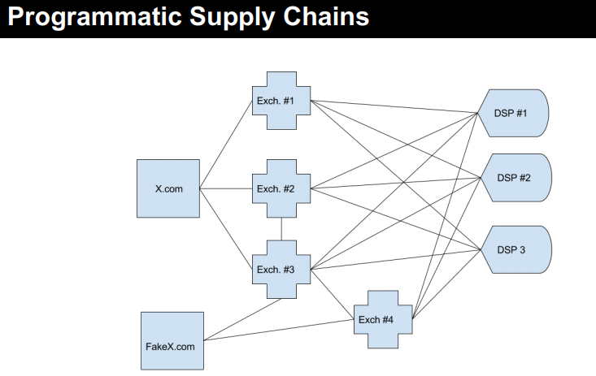
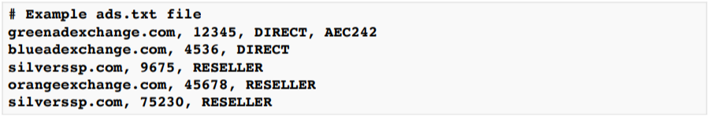
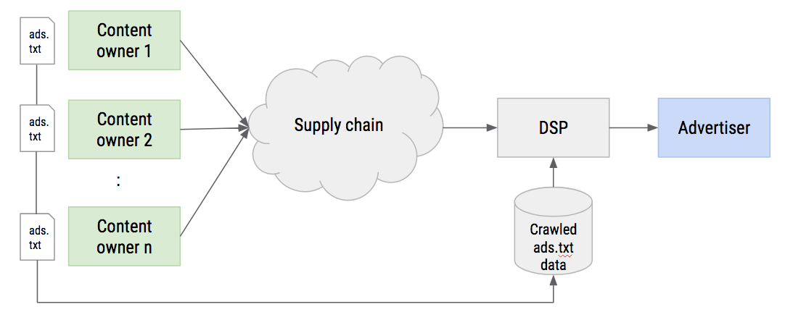

[1. Ads.txt란 무엇인가?](ads.txt.md)

[2. App-ads.txt 알아보기](app-ads.txt.md)

[3. Exelbid 매체에서 ads.txt, app_ads.txt 적용하기](exelbid_ads.txt_guide.md)

# Ads.txt
* 이 문서는 IAB Tech Lab을 인용, 참조하여 작성 되었습니다. (https://iabtechlab.com/ads-txt/)

## # Ads.txt?
- 2017 년 Interactive Advertising Bureau (IAB) Tech Lab에서는 승인되지 않은 웹 인벤토리의 판매를 방지하기 위해 ads.txt 도구를 도입했습니다.  Ads.txt는 Authorized Digital Sellers의 약자로 publisher와 배포자가 디지털 인벤토리 판매 권한을 부여한 회사를 공개적으로 선언하는 데 사용할 수있는 간단하고 유연하며 안전한 방법입니다. Authorized Digital Sellers의 공개 레코드를 작성함으로써 인벤토리 공급망의 투명성을 높이고 게시자가 시장에서 인벤토리를 제어 할 수 있도록하여 악의적 인 행위자가 에코 시스템을 통해 위조 인벤토리를 판매함으로써 이익을 얻는 것을 어렵게 합니다. 게시자가 ads.txt를 채택하면 구매자는 참여하는 게시자의 승인 된 디지털 판매자를 보다 쉽게 식별 할 수 있으므로 브랜드가 진정한 게시자 인벤토리를 구매하고 있다고 확신 할 수 있습니다. 

- Ads.txt는 투명한 프로그램 방식의 디지털 미디어 거래를 지원하며 모조품 및 허위로 표현 된 미디어를 판매하는 데 따른 재정적 인센티브를 제거 할 수 있습니다. robots.txt와 마찬가지로 ads.txt는 게시자의 웹 마스터 만 도메인에 게시 할 수 있으므로 유효하고 확실합니다.
- 게시자는 다양한 판매 채널을 통해 인벤토리를 판매하기 때문에 ads.txt는 다음과 같은 유형의 공급 업체 관계 타입을 지원합니다.
	* 자신의 계정을 통해 거래소에서 판매하는 도메인 소유자 DIRECT
	* 도메인 소유자를 대신하여 프로그래밍 방식으로 판매하는 네트워크 및 영업소 RESELLER
	* 여러 공인 판매자가 동일한 인벤토리를 나타내는 콘텐츠 신디케이션 파트너십 SYNDICATION

## # Ads.txt 의 문제 해결 목표
- 프로그래머틱 광고 생태계의 투명성을 개선하여 생태계 전반에 걸처서 다양한 유형의 위조 인벤토리를 방지하는 것을 목표로 합니다.  
프로그래머틱 환경에서 지면의입찰 요청은 아래와 같이, 실제로는 더욱 복잡하게 구매자(DSP)에게 전달되어집니다.

    * IAB Tech Lab 참조

- 구매자는 프로그래밍 방식으로 미디어(지면)을 구매할 때 구매 한 지면이 해당 퍼블리셔에 의해 합법적으로 판매 되었다라고 전제합니다. 
여기서 문제는 구매자가 exchange를 통해 해당 지면을 판매 할 권한이 있는 사람을 확인 할 방법이 없다는 것입니다.
모든 요청에는 이미 페이지 정보 및 Publisher.ID를 포함하여 OpenRTB 규격안에서 게시자 정보가 포함되어 있지만 해당 Publisher.ID를 소유 한 사람을 확인하는 레코드나 정보등은 없으며, 그 유효성을 확인할 방법이 없습니다.
이부분에서 도메인 스푸핑(Domain Spoofing)등의 위조 인벤토리의 여지가 있습니다.

	* 도메인 스푸핑(Domain Spoofing) - 프리미엄 도메인 이름을 도용하여 다른 URL을 제공하는 형태,  겉으로는 정상적인 곳에 노출되는 것으로 보이지만 사실 무관한 다른 도메인이다.

## # Ads.txt 내용 

- IAB에 의해 요약 된 다음 정보가 포함 되어 있어야 합니다  최대 4개의 필드로 승인된 판매자당 한줄을 설정합니다.

		* 첫번째 필드 : SSP 또는 Exchange의 도메인 네임
		* 두번째 필드 : 퍼블리셔의 계정 ID(SSP 또는 Exchange에 의해 발급되어진)
		* 세번째 필드 : 계정 타입(DIRECT or RESELLER)
		* 네번째 필드 : TAGID

- 참조 링크 : https://iabtechlab.com/wp-content/uploads/2016/07/ADSTXT_OpenRTB_Transparency.pptx.pdf

## # Ads.txt 동작 정의
1. 퍼블리셔(인벤토리 소유자)는 자신의 인벤토리(광고)를 판매하도록 허락한 SSP or Exchange의 목록을 자신의 서버에 텍스트 형식으로 공개합니다.
         
    예) Example.com은 웹 서버에 ads.txt를 게시하여 각 거래소에있는 Example.com의 Publisher ID를 포함하여 인벤토리 판매 권한이있는 5개의 거래소를 나열합니다. 
    http://example.com/ads.txt  
	

2. DSP는 이 텍스트 목록(ads.txt)을 웹 크롤러를 이용해 정기적으로 수집합니다
    	
	 
	* IAB Tech Lab 참조

3. DSP는 이후 Example.com에서 RTB 광고 입찰 요청시에 크롤링된 정보를 통해 판매 목록과 SellerAccountID(Publisher.ID)가 example.com/ads.txt파일에 나열된 승인 판매자인지 확인 할 수 있다.

## # Ads.txt 장단점

    생태계에서 도메인 스푸핑을 막는 데 도움이 되도록 이타적 책임을 다해야 하는 부분도 있지만, 중요한 것은 광고주가 광고 플랫폼에서 기본적으로 ads.txt 인증 게시자만 구매하도록 구성한 경우, 수익을 놓치지 않도록 할 수 있습니다.
	실제로 점점 더 많은 광고주 플랫폼이 ads.txt 인증 게시자 구매를 기본 설정으로 만들어 나가고 있기에 매체는 이에 대한 손실을 막을 수 있다는 장점이 있습니다. 
	
	간편한 설치
	ads.txt 파일 설치는 매우 쉽습니다. robots.txt와 마찬가지로 루트 도메인으로 파일을 복사 할 수 있으며 모든 웹브라우저에서 쉽게 접근 할 수 있습니다.
	
	안전함
	ads.xtx파일은 매우 안전합니다. 웹 사이트 소유자 만이 업로드 할 수 있으며, 권한 없이 컨텐츠를 편집 할 수 없습니다.

	쉬운 편집
	새로운 목록 추가시 최소한의 노력으로 적용 할 수 있습니다. 소유자는 업데이트 된 ads.txt를 다시 업로드 하기만 하면 쉽고 빠르게 편집 할 수 있습니다.
    
	반대로, 매체가 Ads.txt를 잘못 사용시에 해당 오류의 영향을 받는 트랙픽은 수익을 창출 할 수 없습니다. 
	예로, 구매자 업데이트 누락, 유효성 오류(문법 오류)등이 있을 수 있으며, 올바르게 구현하고 확인하는것 또한 중요한 부분입니다.