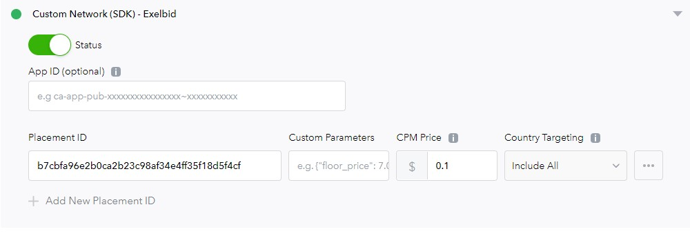

# AppLovin에서의 Ad Mediation
## 지원 버전 및 Ad Format
- Exelbid SDK v1.7.4
- Banner, Native

## App 기본적인 mediation 광고를 위한 설정
  ```xml
  dependencies {
    implementation 'com.onnuridmc.exelbid:exelbid:1.7.4'
    // AppLovin
    implementation 'com.applovin:applovin-sdk:+'
  }
  ```

## AppLovin에서 Exelbid mediation 연동을 위한 설정
[**AppLovin Web interface(https://app.mopub.com/dashboard)**](https://app.mopub.com/dashboard)에서 생성된 광고 Unit Id에 대해서 Exelbid 광고 Unit Id가 매칭되어 응답 되어야 합니다.

### Creating a Custom Network for Exelbid
  1. **Manage->Networks**로 가서 최 하단  **Click here to add a Custom Network**를 선택 생성합니다.
  2. 생성시 Exelbid 1.7.4 이상 버전에 포한된 Adapter Class Name **com.applovin.adapter.ExelbidMediationAdapter**를 적용합니다.
  

### Edit  Ad Unit
  1. **Manage->-Ad Units**에서 해당 unit id를 선택 후 설정합니다.
  2. **위 에서 생성한 Custom Network에 아래와 같이 설정합니다.
  
