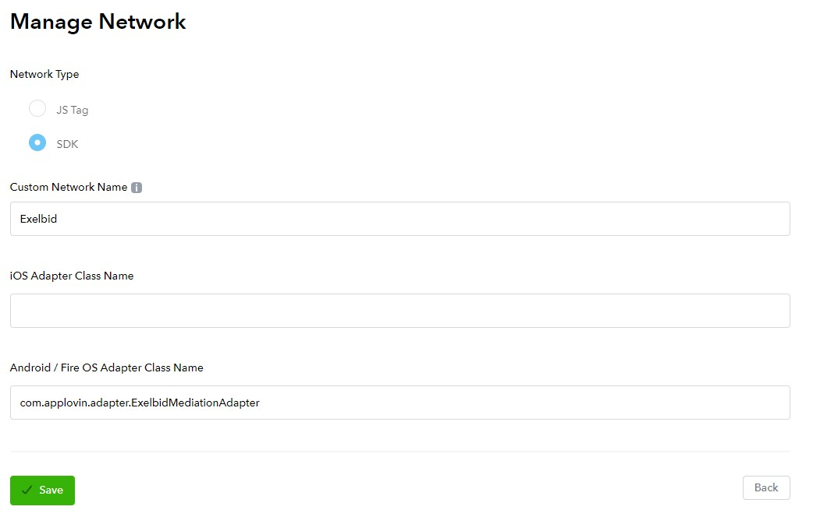
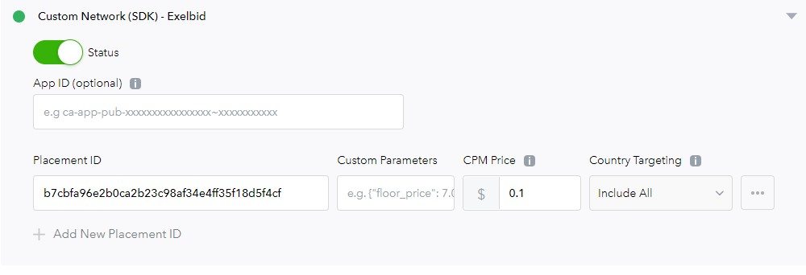

# AppLovin에서의 Exelbid Mediation (Custom Network)

> **레거시 가이드입니다.** AppLovin 커스텀 네트워크 어댑터(`com.applovin.adapter.ExelbidMediationAdapter`)는
> **Exelbid SDK 1.7.x에만 포함**되어 있으며, SDK 2.x에는 포함되어 있지 않습니다.
> SDK 2.x 기반의 타사 미디에이션 연동은 [AdMob 커스텀 이벤트 가이드](./admob_custom_event.md)를 참고하시기 바랍니다.

## 지원 버전 및 Ad Format
- Exelbid SDK v1.7.4
- Banner, Native

## App 설정

```gradle
dependencies {
    implementation 'com.onnuridmc.exelbid:exelbid:1.7.4'
    // AppLovin
    implementation 'com.applovin:applovin-sdk:12.6.0'
}
```

## AppLovin에서 Exelbid mediation 연동을 위한 설정

[AppLovin 대시보드](https://dash.applovin.com/)에서 생성된 광고 Unit Id에 대해서 Exelbid 광고 Unit Id가 매칭되어 응답 되어야 합니다.

### Creating a Custom Network for Exelbid
  1. **Manage → Networks**로 가서 최하단 **Click here to add a Custom Network**를 선택 생성합니다.
  2. 생성시 Exelbid 1.7.4 이상 버전에 포함된 Adapter Class Name : **com.applovin.adapter.ExelbidMediationAdapter**를 적용합니다.
  

### Edit Ad Unit
  1. **Manage → Ad Units**에서 해당 unit id를 선택 후 설정합니다.
  2. 생성한 Custom Network에 아래와 같이 Placement ID에 연결 되어질 Exelbid Unit id를 설정합니다.
  
