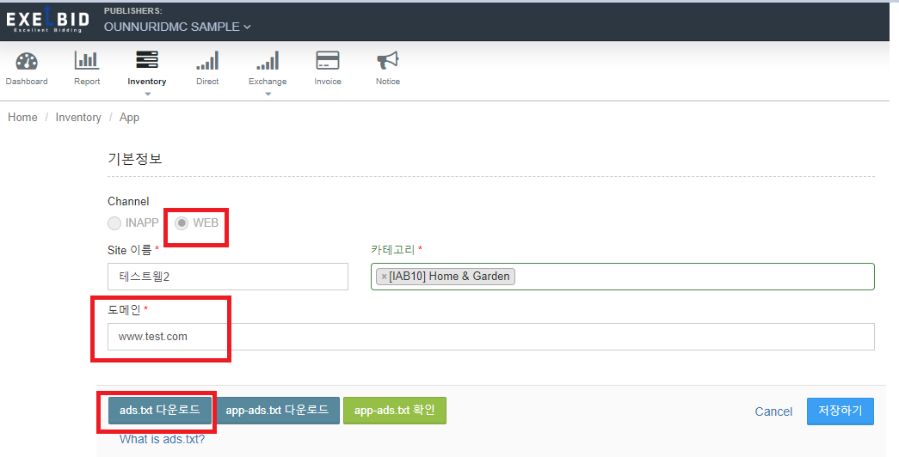
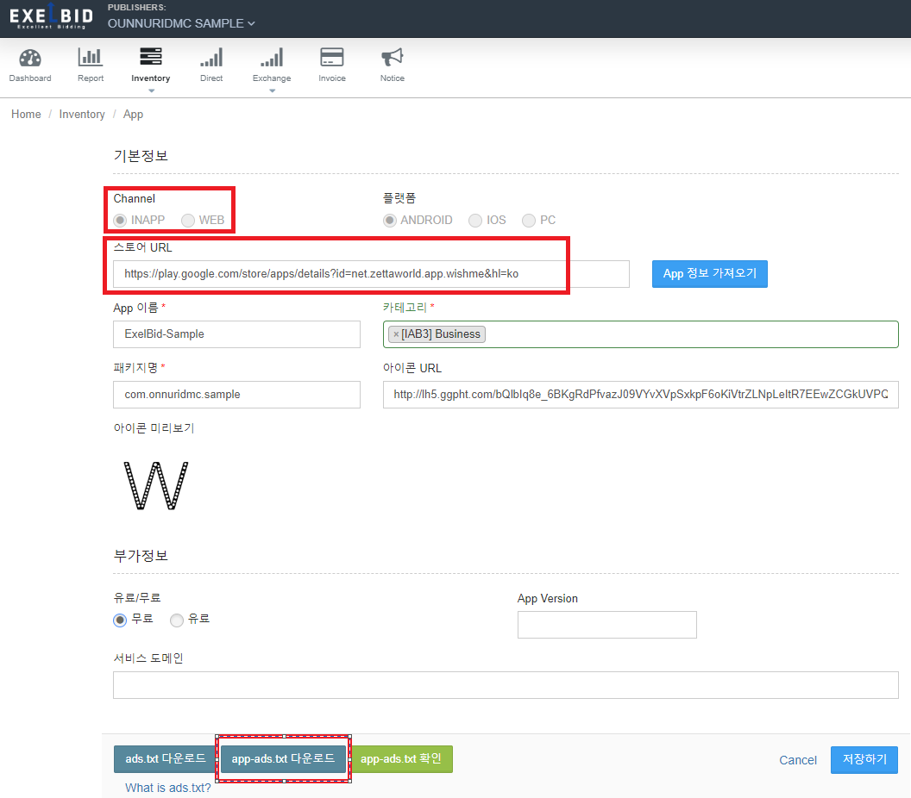
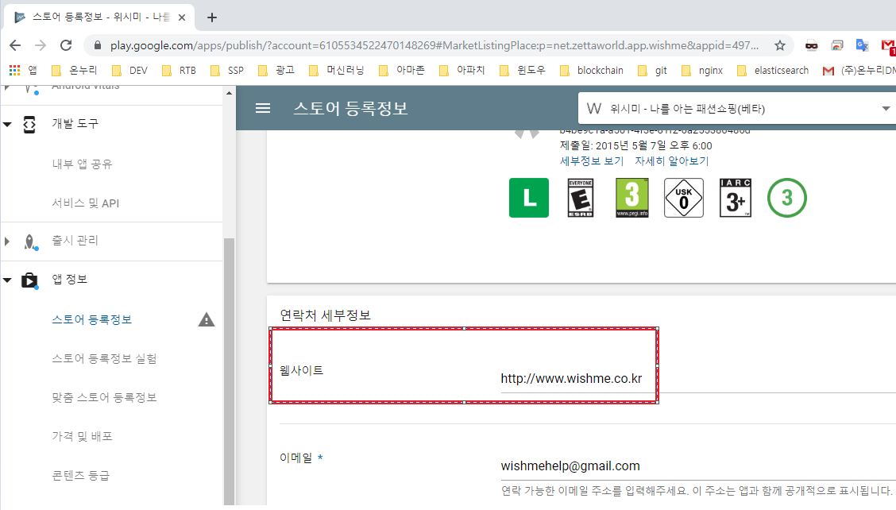

[1. Ads.txt란 무엇인가?](ads.txt.md) 
[2. App-ads.txt 알아보기](app-ads.txt.md) 
[3. Exelbid에서 ads.txt, app_ads.txt 적용하기](exelbid_ads.txt_guide.md)

# Exelbid에서 (app-)ads.txt 적용하기

오늘날 점점 더 많은 브랜드 마케팅 담당자와 광고 구매자 플랫폼(DSP)들이 ads.txt가 구현되지 않은 지면(인벤토리) 구매를 거부하고 있습니다. 이 분위기는 점점 더 모바일 생태계(웹, 앱)로 확대 되고 있습니다. 이는 특정 형태의 광고 부정 행위를 제거하고 업계 전반의 투명성과 효율성을 향상시키는 데 기여하고 있다는 반증입니다.

Exelbid에서도 웹지면에서의 App.txt 그리고 앱지면을 위한 App-ads.txt를 적극 권장하며 지원하고 있습니다. 
Ads.txt, App-ads.txt에 대해서는 위의 링크([1. Ads.txt란 무엇인가?](ads.txt.md), [2. App-ads.txt 알아보기](app-ads.txt.md))에 좀 더 자세히 정리하였습니다. 

이 문서에서는 Exelbid 퍼블리셔가 매체 타입에 따라 ads.txt를 적용하는 방법을 가이드 하고 있습니다. 
\* Exelbid [대시 보드](http://manage.exelbid.com)의 앱 정보에서 (app-)ads.txt를 확인 하실 수 있도록 추가하였습니다.

## App 정보의 Channel에 따른 구분

### - WEB의 경우 ads.txt를 적용
 
\* 참조) Exelbid 대시보드의 앱(웹) 정보 화면

1. Inventory->App->기본 정보의 도메인 정보를 정확히 기입합니다. 
\* 해당 도메인 정보를 기반으로 ads.txt가 결정되므로 정확해야 합니다.

2. 입력한 도메인 루트 경로에 Exelbid [대시 보드](http://manage.exelbid.com)에서 다운받은 ads.txt파일을 업로드 한다. 
    ex) www.test.com/ads.txt                    

3. 타사 연동을 통해 이미 ads.txt가 3.존재한다면 Exelbid의 다운받은 ads.txt 내용을 추가해준다.

### - INAPP 의 경우 app-ads.txt를 적용
 
\* 참조) Exelbid 대시보드의 앱 정보 화면

1. Inventory->App->기본 정보의 스토어 URL을 정확히 기입한다. 

2. 앱스토어 메타정보에 개발자 웹 URL이 정확히 기입 되어 있어야 한다. 
    Ex) GooglePlayConsole의 경우) 앱정보->스토어 등록정보->연락처 세부정보->웹사이트
    
3. 스토어에 등록된 웹사이트의 경로에 app-ads.txt(Exelbid에서 다운로드)를 업로드한다. 
    ex) www.wishme.co.kr/app-ads.txt

4. 역시 타사 연동을 통해 이미 app-ads.txt가 존재한다면 Exelbid의 다운받은 app-ads.txt 내용을 추가해준다.

### - 구현 시 주의점
- robots.txt에 의해 크롤링이 거부되고 있는지 확인이 필요합니다.  
    ex) robots.txt에 'Disallow: /ads/' 와 같은 형식 포함
    
- HTTP 응답 코드 200과 함께 파일이 확인되는지 확인이 필요합니다. 
    크롤러에 의해 파일이 확인 되더라도 응답코드가 200이 아니면 무시되거나 존재하지 않는 것으로 간주 될 수 있습니다.

- HTTPS를 응답도 가능해야 합니다. HTTP와 HTTPS 모두를 통해 ads.txt에 액세스할 수 있는지 확인하세요.
