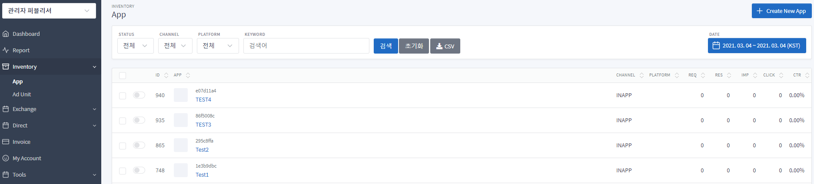

# Exelbid Mediation Guide

Exelbid 미디에이션은 앱에서 연동 중인 광고 SDK들의 **최적화된 호출 순서**를 서버에서 응답합니다(Exelbid 포함).
앱은 응답받은 순서대로 각 광고 SDK를 호출하고, 실패하면 다음 순서로 넘어갑니다.

## 목차
- [1. 대시보드 설정](#1-대시보드-설정)
- [2. SDK 추가](#2-sdk-추가)
- [3. 미디에이션 연동](#3-미디에이션-연동)
- [4. MediationOrderResult API](#4-mediationorderresult-api)
- [형식별 샘플](#형식별-샘플)
- [참고](#참고)

---

## 1. 대시보드 설정

1. 계정을 생성합니다.
2. **Inventory → App → + Create New App**을 선택합니다.<br/>

3. 앱 정보를 등록한 후 unit을 생성합니다. (unit id 발급)
4. 해당 App → unit 기준으로 미디에이션을 설정합니다. (**mediation → 설정하기**)

---

## 2. SDK 추가

Exelbid SDK 기본 연동은 [기본 가이드](./README.md#exelbid-sdk-추가하기)를 참고하시기 바랍니다.

```gradle
repositories {
    mavenCentral()
}

dependencies {
    implementation 'com.onnuridmc.exelbid:exelbid:2.1.0'
}
```

미디에이션 대상 광고 SDK(AdMob, FAN 등)는 각 SDK의 가이드에 따라 별도로 연동해야 합니다. ([참고](#참고))

---

## 3. 미디에이션 연동

`ExelBid.getMediationData`를 호출하면 최적화된 호출 순서를 응답받습니다.

1. **연동된 미디에이션(광고 SDK) 목록 설정**
    - 연동 가능한 광고 SDK는 `Enum`(`MediationType`)으로 제공되며, `ArrayList` 형태로 설정합니다.
    - 설정하지 않으면 대시보드에 설정된 미디에이션 타입이 디폴트로 적용됩니다.
2. **미디에이션 최적화 순서를 받을 리스너 설정**
    - `ExelBid.getMediationData`에 등록한 `OnMediationOrderResultListener`의 `onMediationOrderResult`를 통해
      광고 SDK들의 최적화 호출 순서 정보 객체(`MediationOrderResult`)를 응답받습니다.
3. **목록과 리스너로 미디에이션 데이터 요청**
    - `ExelBid.getMediationData(Context, 'Exelbid Mediation unit id', 연동된 광고 SDK 목록, 리스너)`
4. **순서 응답 시 해당 순서에 따라 광고 SDK 호출**
5. **응답 결과가 없거나 에러 발생 시 `onMediationFail` 호출**

    | Error code | 내용 |
    |---|---|
    | `0` | 정상 응답 |
    | `8010` | UNIT ID 오류. 빈 값이거나 형식 오류 |
    | `8020` | 설정된 리스트가 없다. (국가 정보 포함) |
    | `9xxx` | 네트워크 오류, 응답 Json 파싱 오류 등 |
    | `8888` | 기타 에러 |

```java
// 1. 연동된 미디에이션(광고 SDK) 목록 설정
ArrayList<MediationType> mediationUseList =
        new ArrayList(Arrays.asList(
                MediationType.EXELBID,
                MediationType.ADMOB,
                MediationType.FAN,
                MediationType.ADFIT,
                MediationType.DT,
                MediationType.PANGLE,
                MediationType.APPLOVIN,
                MediationType.TNK
        ));
// 2. 미디에이션 최적화 순서를 받을 리스너 설정 (new OnMediationOrderResultListener)
// 3. 연동된 광고 SDK 목록과 리스너를 이용하여 미디에이션 데이터를 요청한다.
ExelBid.getMediationData(SampleBannerMediation.this, UNIT_ID_EXELBID_BANNER, mediationUseList
        , new OnMediationOrderResultListener() {

            @Override
            public void onMediationOrderResult(MediationOrderResult mediationOrderResult) {
                printLog("Mediation","onMediationOrderResult");

                if(mediationOrderResult != null && mediationOrderResult.getSize() > 0) {
                    SampleBannerMediation.this.mediationOrderResult = mediationOrderResult;
                    // 4. 미디에이션 순서 응답시 해당 순서에 따른 광고 SDK 호출
                    loadMediation();
                }
            }

            @Override
            public void onMediationFail(int errorCode, String errorMsg) {
                // 5. 응답 결과가 없을시, 혹은 에러 발생시 호출된다.
                printLog("Mediation","onMediationFail :: " + errorMsg + "(" + errorCode + ")");
            }
        });
```

### 순서에 따른 광고 SDK 호출

배너 샘플([SampleBannerMediation.java](exelbid-sample-mediation/src/main/java/com/onnuridmc/sample/activity/SampleBannerMediation.java)) 기준 설명입니다.

- `OnMediationOrderResultListener`로 응답받은 `MediationOrderResult` 객체는 `poll()` 호출 시마다
  순서대로 `Pair<MediationType, String>`을 반환합니다.
- 광고 SDK의 종류와 형식(배너, 전면, 네이티브)에 따라 광고 요청 로직을 적용합니다.

```java
// MediationOrderResult가 응답 되었고 각각의 SDK 광고 요청 실패시 호출
private void loadMediation() {
    if(mMediationOrderResult == null) {
        return;
    }
    Pair<MediationType, String> currentMediationPair = mediationOrderResult.poll();
    if(currentMediationPair == null) {
        return;
    }
    currentMediationType = currentMediationPair.first;
    currentMediationUnitId = currentMediationPair.second;

    // 광고 SDK의 종류와 형식(배너, 전면, 네이티브) 에 따라서 광고 요청 로직을 적용한다
     if (currentMediationType.equals(MediationType.EXELBID)) {
        exelbidAdView.setAdUnitId(currentMediationUnitId);
        exelbidAdView.loadAd();
    } else if (currentMediationType.equals(MediationType.ADMOB)) {
        if(admobView.getAdUnitId() == null){
            admobView.setAdSize(com.google.android.gms.ads.AdSize.BANNER);
            admobView.setAdUnitId(currentMediationUnitId);
        }
        admobView.loadAd(new AdRequest.Builder().build());
    } else if (currentMediationType.equals(MediationType.FAN)) {
        if(fanView == null || !fanView.getPlacementId().equals(currentMediationUnitId)) {
            fanView = new com.facebook.ads.AdView(this, currentMediationUnitId, AdSize.BANNER_HEIGHT_50);
            fanAdView.addView(fanView);
        }
        fanView.loadAd(fanView.buildLoadAdConfig().withAdListener(fanAdListener).build());
    } else if (currentMediationType.equals(MediationType.ADFIT)) {
        adfitAdView.setClientId(currentMediationUnitId);
        adfitAdView.loadAd();
    } else if (currentMediationType.equals(MediationType.DT)) {
        if (dtAdSpot.isReady()) {
            dtAdController.unbindView(dtView);
        }
        dtAdSpot.requestAd(new InneractiveAdRequest(currentMediationUnitId));
    } else if (currentMediationType.equals(MediationType.PANGLE)) {
        if(pagAd != null) {
            pangleView.removeView(pagAd.getBannerView());
        }
        pagAd.loadAd(currentMediationUnitId, pagRequest, pagAdListener);
    } else if (currentMediationType.equals(MediationType.APPLOVIN)) {
        if(maxAdView == null || !maxAdView.getAdUnitId().equals(currentMediationUnitId)) {
            maxAdView = new MaxAdView(currentMediationUnitId, this);
            maxAdView.setListener(maxAdListener);
            adContainer.addView(maxAdView);
        }
        maxAdView.loadAd();
    } else if (currentMediationType.equals(MediationType.TNK)) {
        if(tnkAdView == null || !tnkAdView.getPlacementId().equals(currentMediationUnitId)) {
            tnkAdView = new com.tnkfactory.ad.BannerAdView(this, currentMediationUnitId);
            tnkAdView.setListener(tnkAdListener);
            adContainer.addView(tnkAdView);
        }
        tnkAdView.load();
    }
}
```

---

## 4. MediationOrderResult API

- `int getSize()` — 응답된 미디에이션 광고 목록의 개수를 반환
- `Pair<MediationType, String> poll()` — 응답된 미디에이션 광고 목록에서 최우선 순위의 미디에이션 데이터
  `Pair<MediationType, String>`을 반환 후 목록에서 삭제
  - `MediationType` : 현재 순서의 미디에이션 타입
  - `String` : 현재 순서의 광고 유닛 아이디 (미디에이션 타입에 해당하는 광고 SDK의 지면 아이디)
- `reset()` — `OnMediationOrderResultListener`를 통해서 응답받은 목록 개수와 순서로 `MediationOrderResult`를 초기화

---

## 형식별 샘플

위의 배너 샘플과 같은 방식으로 광고 타입별 샘플을 참고하여 적용합니다.
샘플 전체는 [`exelbid-sample-mediation`](exelbid-sample-mediation) 모듈에 있습니다.

- 배너 : [SampleBannerMediation.java](exelbid-sample-mediation/src/main/java/com/onnuridmc/sample/activity/SampleBannerMediation.java)
- 전면 : [SampleInterstitialMediation.java](exelbid-sample-mediation/src/main/java/com/onnuridmc/sample/activity/SampleInterstitialMediation.java)
  - 전면 비디오 광고 : 전면 광고와 동일하게 처리합니다. 광고 SDK별 비디오 설정은 각 SDK 가이드를 참고해주세요.
- 네이티브 : [SampleNativeMediation.java](exelbid-sample-mediation/src/main/java/com/onnuridmc/sample/activity/SampleNativeMediation.java)
  - 네이티브 동영상 광고 : 네이티브 광고와 동일하게 적용합니다. 광고 SDK별 비디오 설정은 각 SDK 가이드를 참고해주세요.

---

## 참고

Exelbid 기본 연동은 [기본 가이드](./README.md)를, 타사 광고 SDK 연동은 각 SDK의 가이드를 참조하시기 바랍니다.

- AdMob - [https://developers.google.com/admob/android/quick-start?hl=ko](https://developers.google.com/admob/android/quick-start?hl=ko)
- FaceBook - [https://developers.facebook.com/docs/audience-network/guides/ad-formats](https://developers.facebook.com/docs/audience-network/guides/ad-formats)
- Kakao-Adfit - [https://github.com/adfit/adfit-android-sdk/blob/master/docs/GUIDE.md](https://github.com/adfit/adfit-android-sdk/blob/master/docs/GUIDE.md)
- DigitalTurbine - [https://developer.digitalturbine.com/hc/en-us/articles/360010822437-Integrating-the-Android-SDK](https://developer.digitalturbine.com/hc/en-us/articles/360010822437-Integrating-the-Android-SDK)
- Pangle - [https://www.pangleglobal.com/kr/integration/integrate-pangle-sdk-for-android](https://www.pangleglobal.com/kr/integration/integrate-pangle-sdk-for-android)
- Applovin - [https://dash.applovin.com/documentation/mediation/android/getting-started/integration](https://dash.applovin.com/documentation/mediation/android/getting-started/integration)
- Tnk - [https://github.com/tnkfactory/android-sdk/blob/master/Android_Guide.md](https://github.com/tnkfactory/android-sdk/blob/master/Android_Guide.md)
