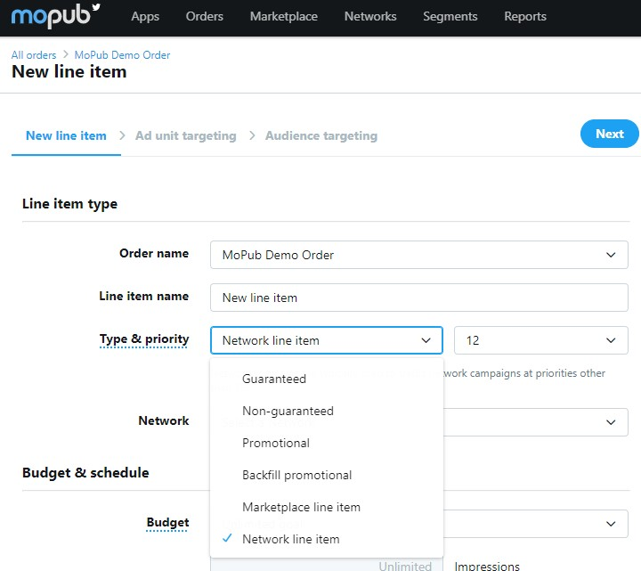
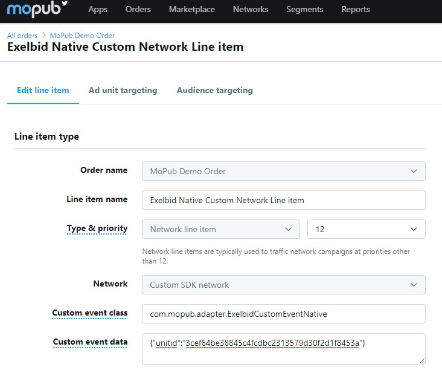

# Mopub에서의 Ad Mediation
## 지원 버전 및 Ad Format
- Exelbid SDK v1.6.6
- Banner, Native

## App 기본적인 mediation 광로를 위한 설정
  ```xml
  dependencies {
    implementation 'com.onnuridmc.exelbid:exelbid:1.6.6'
    // Mopub
    implementation('com.mopub:mopub-sdk:+@aar') {
        transitive = true
    }
  }
  ```

## Mobpu에서 Exelbid mediation 연동을 위한 설정
[***Mopub Web interface***](https://app.mopub.com/dashboard)에서 생성된 광고 Unit Id에 대해서 Exelbid 광고 Unit Id가 매칭되어 응답 되어야 합니다.

### Creating An Ad Unit
  1. **메인-Apps**에서 **New ad Unit**을 선택하여 Ad unit을 생성합니다.
  2. 생성된 **Ad unit ID**를 확인합니다.
### Creating a Network Lineitem
  1. **Orders**로 가서 **Create Order**를 선택 생성합니다.
  2. 해당 Orders로 이동 후 New line item을 선택 합니다.
  3. Line item name을 적절히 설정 후 Type을 Network line item으로 설정합니다.
  
  4. Network는 Custom SDK network를 선택합니다.
  
  5. Custom event class을 기입합니다. <br/>
    * Banner : ***com.mopub.adapter.ExelbidCutomBaseAd***<br/>
    * Native : ***com.mopub.adapter.ExelbidCustomEventNative***<br/>
  6. Custom event data를 아래화 같은 형식으로 작성합니다.<br/>
    * ***{"unitid":"3cef64be38845c4fcdbc2313579d30f2d1f8453a"}***<br/>
    * 위 unitid는 Exelbid에서 생성된 unitid로 반드시 Json형태로 위와 같이 적용 되어야 합니다.
    <br/><br/>
  

## Mobpu광고 연동을 위한 기본 설정
  1. [***Banner ads***](https://developers.mopub.com/publishers/android/banner/) - Mopub Banner 설명서를 따르세요
  2. [***Native ads***](https://developers.mopub.com/publishers/android/native-adplacer/) - Mopub Native 설명서를 따르세요. Native Video 형식은 지원되지 않습니다. 
