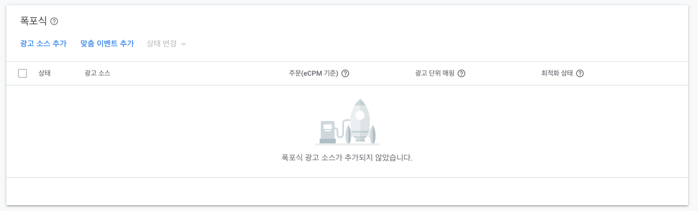
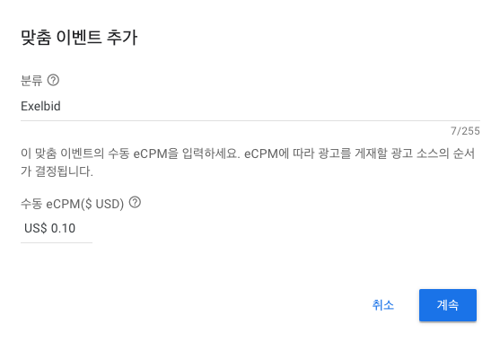
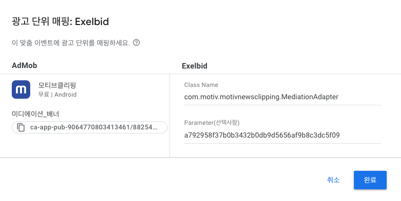

# **Admob Mediation 엑셀비드 연동 가이드**

목차
=================
- [Admob UI 미디에이션 설정](#Admob-UI-미디에이션-설정)
- [커스텀 어댑터 구현](#커스텀-어댑터-구현)
  - [1. 어댑터 초기화](#1-어댑터-초기화)
  - [2. 광고 포맷별 어댑터 구현](#2-광고-포맷별-어댑터-구현)
  - [2-A. 배너 광고](#2-A-배너-광고)
  - [2-B. 전면 광고](#2-B-전면-광고)
  - [2-C. 네이티브 광고](#2-C-네이티브-광고)
- [ETC](#ETC)
  
## Admob UI 미디에이션 설정

Admob UI [https://admob.google.com/home/](https://admob.google.com/home/)

1. 미디에이션 그룹 생성 혹은 기존 미디에이션 그룹 수정
2. 광고 소스 > 폭포식 > 맞춤 이벤트 추가

    
    
3. 맞춤 이벤트 추가
    
    
    
4. 광고 단위 매핑
    
    
    
    - Class Name: 앱 내에 구현한 커스텀 어댑터의 클래스 이름 겸 경로
    
      (모티브 클리핑 앱 예시: `com.motiv.motivnewsclipping.MediationAdapter`)
        
    - Parameter : 엑셀비드 유닛 ID

5. 저장

## 커스텀 어댑터 구현


### 1. 어댑터 초기화

애드몹 SDK 가 초기화 될 때,  커스텀 어댑터의 `initialize` 메서드가 호출됩니다.

initialize 메서드를 통해 엑셀비드 SDK 를 초기화하고, 초기화 상태를 애드몹 SDK 에 알립니다.

```java
/** 애드몹 미디에이션 광고 초기화 */
    @Override
    public void initialize(@NonNull Context context,
                           @NonNull InitializationCompleteCallback initializationCompleteCallback,
                           @NonNull List<MediationConfiguration> mediationConfigurations) {
        ExelBid.init(context);
        initializationCompleteCallback.onInitializationSucceeded();
        Log.d( "Exelbid_SDK_initialized", "Success");
    }
```

### 2. 광고 포맷별 어댑터 구현

### 2-A. 배너 광고

배너 광고 어댑터 샘플 코드

```java
/** 애드몹 미디에이션 배너 광고 load */
    @Override
    public void loadBannerAd(
            @NonNull MediationBannerAdConfiguration adConfiguration,
            @NonNull MediationAdLoadCallback<MediationBannerAd, MediationBannerAdCallback> adLoadCallback
    ) {
        Context context = adConfiguration.getContext();

        /** 애드몹 UI 에 파라미터로 설정한 엑셀비드 Unit ID */
        String unitId = adConfiguration.getServerParameters().getString(MediationConfiguration.CUSTOM_EVENT_SERVER_PARAMETER_FIELD);

        /** Exelbid 배너 광고 세팅 */
        exelbidAdView = new ExelBidAdView(context);
        exelbidAdView.setAdUnitId(unitId);
        exelbidAdView.loadAd();
        exelbidAdView.setAdListener(new OnBannerAdListener() {
            @Override
            public void onAdLoaded() {
                /** MediationBannerAd 전달
                 * MediationBannerAd.getView() 호출 시,
                 * exelbidAdView 리턴
                 * */
                MediationBannerAdCallback = adLoadCallback.onSuccess(
                        new MediationBannerAd() {
                            @NonNull
                            @Override
                            public View getView() {
                                return exelbidAdView;
                            }
                        }
                );
                Log.d("EXELBID", "onAdLoaded");
            }

            @Override
            public void onAdFailed(ExelBidError errorCode, int statusCode) {
                /** 광고 요청 실패 전달 */
                adLoadCallback.onFailure(toAdmobError(errorCode));
                Log.d("EXELBID", "onAdFailed");
            }

            @Override
            public void onAdClicked() {
                /** 광고 클릭 전달 */
                MediationBannerAdCallback.reportAdClicked();
                Log.d("EXELBID", "onAdClicked");
            }
        });
    }
```

### 2-B. 전면 광고

전면 광고 어댑터 샘플 코드

```java
/** 애드몹 미디에이션 전면 광고 load */
    @Override
    public void loadInterstitialAd(
            @NonNull MediationInterstitialAdConfiguration adConfiguration,
            @NonNull MediationAdLoadCallback<MediationInterstitialAd, MediationInterstitialAdCallback> adLoadCallback) {
        Context context = adConfiguration.getContext();

        /** 애드몹 UI 에 파라미터로 설정한 엑셀비드 Unit ID */
        String unitId = adConfiguration.getServerParameters().getString(MediationConfiguration.CUSTOM_EVENT_SERVER_PARAMETER_FIELD);

        /** Exelbid 전면 광고 세팅 */
        exelbidInterstitialAd = new ExelBidInterstitial(context, unitId);
        exelbidInterstitialAd.loadAd();
        exelbidInterstitialAd.setInterstitialAdListener(new OnInterstitialAdListener() {
            @Override
            public void onInterstitialLoaded() {
                /** MediationInterstitialAd 전달
                 * MediationInterstitialAd.showAd() 호출 시,
                 * exelbidInterstitialAd.show() 호출
                 * */
                MediationInterstitialAdCallback = adLoadCallback.onSuccess(
                        new MediationInterstitialAd() {
                            @Override
                            public void showAd(@NonNull Context context) {
                                exelbidInterstitialAd.show();
                            }
                        }
                );
                Log.d("EXELBID", "onInterstitialLoaded");
            }

            @Override
            public void onInterstitialShow() {
                /** 광고 노출 전달 */
                MediationInterstitialAdCallback.reportAdImpression();
                MediationInterstitialAdCallback.onAdOpened();
                Log.d("EXELBID", "onInterstitialShow");
            }
            @Override
            public void onInterstitialDismiss() {
                /** 광고 닫힘 전달 */
                MediationInterstitialAdCallback.onAdClosed();
                Log.d("EXELBID", "onInterstitialDismiss");
            }
            @Override
            public void onInterstitialClicked() {
                /** 광고 클릭 전달 */
                MediationInterstitialAdCallback.reportAdClicked();
                Log.d("EXELBID", "onInterstitialClicked");
            }

            @Override
            public void onInterstitialFailed(ExelBidError errorCode, int statusCode) {
                /** 광고 요청 실패 전달 */
                adLoadCallback.onFailure(toAdmobError(errorCode));
                Log.d("EXELBID", "onAdFailed");
            }
        });
    }
```

### 2-C. 네이티브 광고

네이티브 광고 호출을 위한 커스텀 어댑터와 커스텀 매퍼를 구현합니다.

네이티브 광고의 경우, 엑셀비드 네이티브 에셋 데이터를 애드몹 광고에 매핑시키기 위한 커스텀 매퍼의 구현이 필요합니다.

- 커스텀 어댑터 구현 샘플 코드

```java
/** 애드몹 미디에이션 네이티브 광고 load */
    @Override
    public void loadNativeAd(
            @NonNull MediationNativeAdConfiguration adConfiguration,
            @NonNull MediationAdLoadCallback<UnifiedNativeAdMapper, MediationNativeAdCallback> adLoadCallback){
        Context context = adConfiguration.getContext();
        /** 애드몹 UI 에 파라미터로 설정한 엑셀비드 Unit ID */
        String unitId = adConfiguration.getServerParameters().getString(MediationConfiguration.CUSTOM_EVENT_SERVER_PARAMETER_FIELD);
        /** Exelbid 네이티브 광고 세팅 */
        exelbidNativeAd.loadAd();
        /** 네이티브 요청시 필수로 존재해야 하는 값을 세팅한다. 애드몹 필수 에셋은 TITLE */
        exelbidNativeAd.setRequiredAsset(
                new NativeAsset[] {
                        NativeAsset.TITLE
                }
        );
        exelbidNativeAd = new ExelBidNative(context, unitId, new OnAdNativeListener() {
            @Override
            public void onLoaded() {
                /** ExelbidNativeMediationMapper(커스텀 매퍼) 전달 */
                ExelbidNativeMediationMapper mapper = new ExelbidNativeMediationMapper(context, exelbidNativeAd);
                MediationNativeAdCallback = adLoadCallback.onSuccess(mapper);
                Log.d("EXELBID", "onLoaded");
            }
            @Override
            public void onFailed(ExelBidError error, int statusCode) {
                /** 광고 요청 실패 전달 */
                adLoadCallback.onFailure(toAdmobError(error));
                Log.d("EXELBID", "onFailed");
            }
            @Override
            public void onShow() {
                /** 광고 노출 전달 */
                MediationNativeAdCallback.reportAdImpression();
                MediationNativeAdCallback.onAdOpened();
                Log.d("EXELBID", "onShow");
            }
            @Override
            public void onClick() {
                /** 광고 클릭 전달 */
                MediationNativeAdCallback.reportAdClicked();
                Log.d("EXELBID", "onClick");
            }
        });
    }
```

- 커스텀 매퍼 클래스 구현 샘플 코드

```java
public class ExelbidNativeMediationMapper extends UnifiedNativeAdMapper {

    private ExelBidNative exelbidNativeAd;
    private AdNativeData adNativeData;

    /** 엑셀비드 네이티브 광고 데이터를 애드몹 광고에 매핑시킨다 */
    public ExelbidNativeMediationMapper(Context context, ExelBidNative exelbidNativeAd) {
        this.exelbidNativeAd = exelbidNativeAd;
        adNativeData = exelbidNativeAd.getNativeAdData();

        setHasVideoContent(false);
        setHeadline(adNativeData.getTitle());                       /** 제목 */
        setBody(adNativeData.getText());                            /** 설명 */
        setCallToAction(adNativeData.getCtatext());                 /** cta버튼 */
        setStarRating((double) adNativeData.getRating());           /** 별점 */

        /** 메인 이미지 */
        List<NativeAd.Image> imagesList = new ArrayList<NativeAd.Image>();
        imagesList.add(new ExelbidImage(adNativeData.getMain()));
        setImages(imagesList);
        /** 아이콘 */
        setIcon(new ExelbidImage(adNativeData.getIcon()));
        /** 광고정보표시 아이콘 */
        ImageView adChoice = new ImageView(context);
        ImageLoader.getInstance().displayImage(adNativeData.getAdInfoImgUrl(), adChoice);
        setAdChoicesContent(adChoice);
    }

    /** 네이티브 광고 노출 핸들링 */
    @Override
    public void recordImpression() {
        super.recordImpression();
        exelbidNativeAd.imp();
    }

    /** 네이티브 광고 클릭 핸들링 */
    @Override
    public void handleClick(@NonNull View view) {
        super.handleClick(view);
        if(view.getTag() != null) {
            String tagid = (String) view.getTag();
            if(tagid.equals("info_icon")) {
                /** 광고정보표시 아이콘 클릭 시 */
                exelbidNativeAd.clickInfoIcon(view);
                return;
            }
        }
        exelbidNativeAd.click(view);
    }

    /** view 가 랜더링 되기 이전에, 노출 또는 클릭 트래킹 관련 작업이 필요한 경우, 세팅해준다  */
    @Override
    public void trackViews(@NonNull View ContainerView, @NonNull Map<String, View> clickableAssetViews, @NonNull Map<String, View> nonclickableAssetViews) {
        super.trackViews(ContainerView, clickableAssetViews, nonclickableAssetViews);
        /**  광고정보표시 view 식별을 위해 해당 뷰에 "info_icon" 태깅 */
        View infoIconView = clickableAssetViews.get("3012");
        infoIconView.setTag("info_icon");
    }

    /** 에셋으로 들어갈 이미지(메인, 아이콘)는 애드몹 이미지 에셋 형식에 맞춘다 */
    public class ExelbidImage extends NativeAd.Image {
        private final String url;
        private final double scale;
        private Drawable downloadedImage = null;

        public ExelbidImage(String url) {
            this.url = url;
            this.scale = 1.0;
        }

        @NonNull
        @Override
        public Drawable getDrawable() {
            if (downloadedImage != null) {
                return downloadedImage;
            }
            try {
                Bitmap x;

                HttpURLConnection connection = (HttpURLConnection) new URL(url).openConnection();
                connection.connect();
                InputStream input = connection.getInputStream();

                x = BitmapFactory.decodeStream(input);
                downloadedImage = new BitmapDrawable(Resources.getSystem(), x);
                return downloadedImage;
            } catch (Exception exception) {
                return new ShapeDrawable(new RectShape());
            }
        }

        @NonNull
        @Override
        public Uri getUri() {
            return Uri.parse(url);
        }

        @Override
        public double getScale() {
            return scale;
        }
    }
}
```
## ETC

### Exelbid SDk 기본 연동 및 광고 호출은 ExelBid-Android-SDK 연동 가이드를 참조해 설정합니다.

[ExelBid-Android-SDK 연동 가이드 참조](https://github.com/onnuridmc/ExelBid-Android-SDK)

### Admob SDK 연동 및 Admob 미디에이션 기능은 각각의 해당 가이드를 참조해 설정합니다.
* AdMob - [https://developers.google.com/admob/android/quick-start?hl=ko](https://developers.google.com/admob/android/quick-start?hl=ko)
* AdMob 미디에이션 - [https://developers.google.com/admob/android/mediate?hl=ko](https://developers.google.com/admob/android/mediate?hl=ko)
